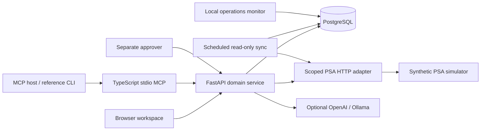

# ConnectWise Service Operations MCP

An approval-controlled workspace for service-ticket operations.

Read the right ticket, prepare an internal note or documented time entry, obtain a separate person's approval, and verify the resulting record. The browser workspace and six-tool MCP server share the same authorization, approval, and recovery controls.

> From ticket evidence to an approved, verified update.

[](docs/showcase/README.md)

[Product walkthrough](docs/showcase/README.md) · [Engineering case study](docs/CASE-STUDY.md) · [Evidence](docs/ACCEPTANCE-CHECKLIST.md) · [Run locally](docs/LOCAL-SETUP.md) · [Documentation](docs/README.md)

**TypeScript / MCP · Python / FastAPI · PostgreSQL · Docker · OpenAI / Ollama**

Validated against a two-tenant synthetic PSA simulator. Azure deployment and live ConnectWise tenant validation are the next integration milestones.

## Evidence snapshot

| Result | What was exercised | Evidence |
| ---: | --- | --- |
| **62 tests** | Backend authorization, workflow, providers, skills, evaluation controls, automation and browser API | [Regression report](docs/evidence/workspace-regression.json) |
| **11 scenarios** | Real stdio MCP protocol, scoped tools, separate approval, interrupted writes and recovery | [MCP acceptance](docs/evidence/workspace-regression.json) |
| **8 checks** | Browser note/time workflows, recovery, tenant switching, mobile layout, storage, sign-out and runtime errors | [Browser acceptance](docs/evidence/workspace-browser.json) |
| **135/135 tasks** | Declared normal, peak and two-minute soak workload; 33 verified writes and zero observed duplicate effects | [Reliability qualification](docs/PHASE-7-DELIVERY.md) |
| **8/8 per provider** | OpenAI and Ollama evidence selection on a frozen held-out synthetic set | [Quality evaluation](docs/PHASE-6-DELIVERY.md) |
| **11 steps** | Installation from a fresh source archive, generated credentials, worker/monitor readiness and restart persistence | [Installation record](docs/evidence/workspace-installation.json) |

These are measured results from finite local suites. The linked reports describe each environment and denominator; customer productivity and cloud capacity have not been measured.

## Why it exists

A plausible ticket update can still target the wrong customer, expose an internal note, invent working time, or be posted twice after a timeout. Service operations need explicit ownership and proof of completion alongside useful automation.

This project keeps those decisions in the application: scope determines which evidence a user can read, a separate approver accepts one exact proposal, and a successful write must match its downstream read-back.

## Product workflow

```text
Scoped ticket context → Proposal → Separate-user approval → Execute → Verify
                                                               ↘ Unknown → Reconcile
```

| Stage | Operator experience | Enforced behavior |
| --- | --- | --- |
| Read | Ticket, company, board and source notes in one workspace | Tenant/company/board scope checked on the server |
| Prepare | Internal note or time entry with technician evidence | Fixed internal visibility; explicit minutes and start time |
| Approve | A different account reviews the exact payload | Approval bound to payload hash and fresh source state |
| Execute | The original proposer submits the approved update | Durable dispatch record and idempotent proposal replay |
| Verify | Receipt, downstream ID and recoverable outcome | Read-back comparison; uncertain writes reconciled without automatic reposting |

Optional AI selects attributed source evidence. It cannot grant permissions, approve a proposal, or execute a business write. Status and assignment suggestions remain recommendations.

## Product tour

<table>
  <tr>
    <td width="50%">
      <a href="docs/showcase/workspace-draft.png"></a><br>
      <strong>Context before action</strong><br>
      Review source notes and supply technician observations.
    </td>
    <td width="50%">
      <a href="docs/showcase/workspace-approval.png"></a><br>
      <strong>Explicit human approval</strong><br>
      Review the payload and evidence under a separate identity.
    </td>
  </tr>
  <tr>
    <td width="50%">
      <a href="docs/showcase/workspace-unknown.png"></a><br>
      <strong>Uncertainty stays visible</strong><br>
      A lost response produces an unknown outcome requiring reconciliation.
    </td>
    <td width="50%">
      <a href="docs/showcase/workspace-recovered.png"></a><br>
      <strong>Recovery with one effect</strong><br>
      Find the existing record and verify its fields without posting again.
    </td>
  </tr>
</table>

Screenshots come from the working application against an isolated synthetic simulator. The [walkthrough](docs/showcase/README.md) explains the sequence; the [CLI/MCP recording](docs/demo/demo.html) provides a second interface to the same workflow.

## Architecture



The domain service owns authorization, proposal freshness, approval, dispatch and verification. PostgreSQL stores durable operations and synchronization checkpoints. The worker refreshes source data; the monitor records health and local alerts. The browser and MCP are two clients of this shared service.

See the [architecture guide](docs/ARCHITECTURE.md), [MCP contract](docs/PHASE-4-MCP.md), and [PSA reference subset](contracts/PSA-SUBSET.md) for implementation details.

## Run locally

Requires Git, Python 3.10+, Docker with Linux containers and Compose v2. The deterministic workflow needs no model key or ConnectWise account.

```sh
git clone https://github.com/williamlo90/connectwise-service-operations-mcp.git
cd connectwise-service-operations-mcp
python scripts/setup_local.py
docker compose -f compose.yaml -f compose.ops.yaml --profile tools --profile automation build
docker compose -f compose.yaml -f compose.ops.yaml up -d --wait api
docker compose -f compose.yaml -f compose.ops.yaml run --rm seed
docker compose -f compose.yaml -f compose.ops.yaml --profile automation up -d --wait worker monitor
```

Open **http://localhost:8030/**. Sign in as `op-a` using the generated `DEMO_PASSWORD` in your ignored `.env`. Prepare an update, switch to `approver-a` for approval, then return to `op-a` to execute. Repository access is required while it remains private.

The [setup guide](docs/LOCAL-SETUP.md) covers resources, alternate ports and lifecycle commands. The [operator guide](docs/USER-GUIDE.md) covers browser, CLI and recovery workflows.

```sh
python scripts/test_local.py
```

The regression runner creates an isolated test stack and cleans it up. It makes no paid model requests. Run disposable suites serially; see [browser reproduction](docs/WORKSPACE-UI.md#reproduce-browser-acceptance) for the UI checks.

## Explore the engineering

| Interested in… | Start here |
| --- | --- |
| Problem, contribution and engineering tradeoffs | [Case study](docs/CASE-STUDY.md) |
| Current results and reproducible evidence | [Acceptance checklist](docs/ACCEPTANCE-CHECKLIST.md) |
| Design, permissions and failure handling | [Architecture](docs/ARCHITECTURE.md) |
| Incremental learning from Phase 0 through Phase 8 | [Learning checkpoints](docs/LEARNING-CHECKPOINTS.md) |
| Monitoring, backup, restore and rollback | [Operations runbook](docs/OPERATIONS-RUNBOOK.md) |
| CV, LinkedIn and interview material | [Portfolio copy](docs/PORTFOLIO-COPY.md) |
| Azure and vendor integration milestones | [Roadmap](docs/ROADMAP.md) |

## License

Copyright © 2026 William (williamlo90). **All Rights Reserved.** Original code, documentation and media require written permission for reuse. Platform rights and third-party licenses remain unaffected. See [LICENSE](LICENSE) and [third-party notices](THIRD-PARTY-NOTICES.md).
