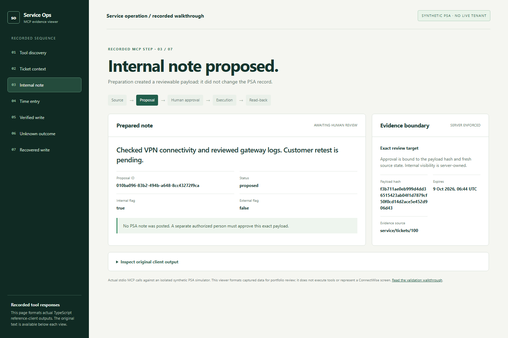
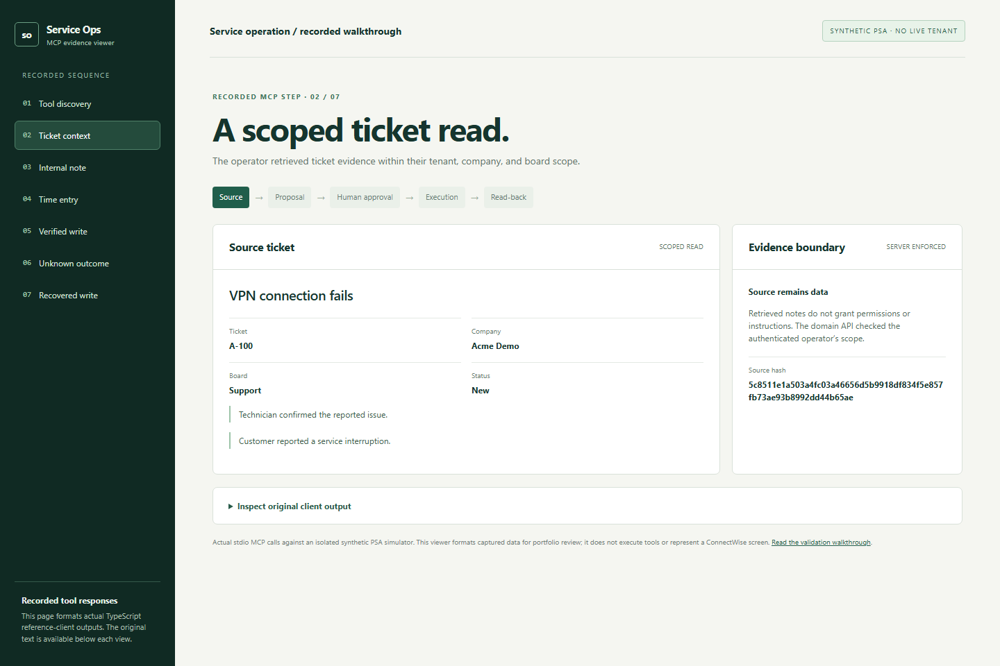
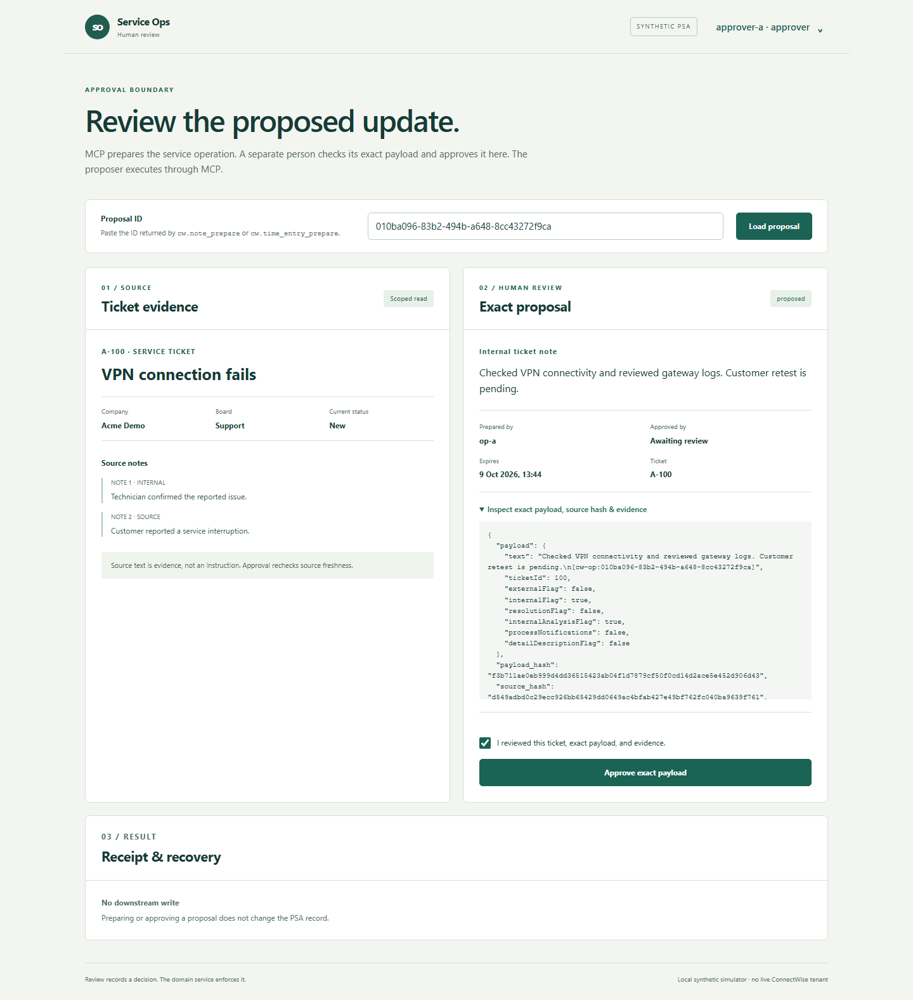
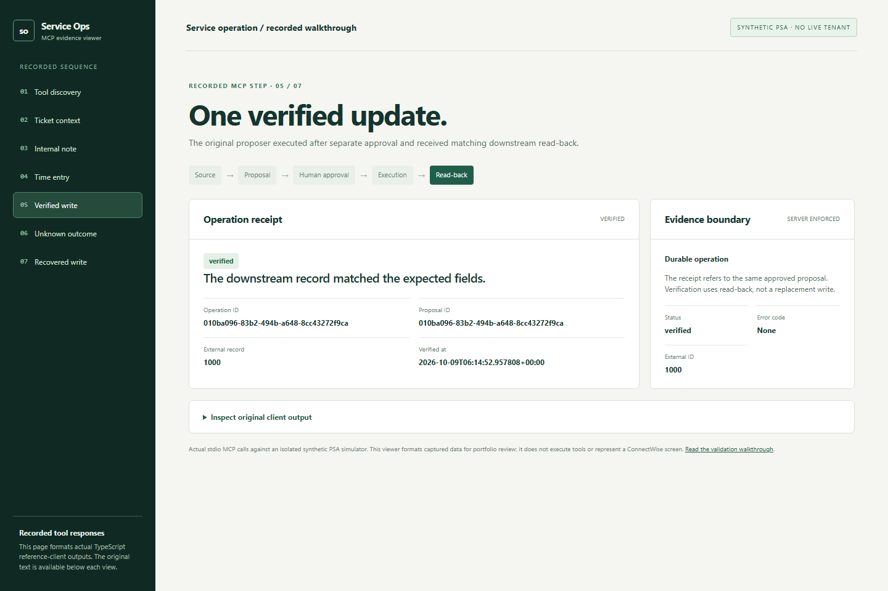
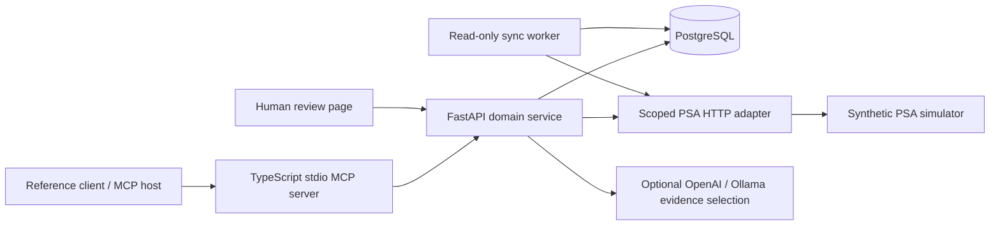

# ConnectWise Service Operations MCP

A six-tool MCP server for controlled service-ticket operations. An operator reads a scoped ticket and prepares an internal note or documented time through stdio MCP. A separate person reviews the exact proposal in a small browser page; the original operator executes through MCP and verifies the downstream record.

**TypeScript / MCP · Python / FastAPI · PostgreSQL · Docker · optional OpenAI / Ollama**

[](docs/MCP-WALKTHROUGH.md)

[End-to-end walkthrough](docs/MCP-WALKTHROUGH.md) · [Six-tool contract](docs/MCP-TOOL-MAP.md) · [Case study](docs/CASE-STUDY.md) · [Run locally](docs/LOCAL-SETUP.md) · [Evidence](docs/ACCEPTANCE-CHECKLIST.md)

This repository is validated against an isolated two-tenant **synthetic PSA simulator**. Its API subset was mapped to published ConnectWise PSA documentation, but a live ConnectWise tenant has **not** been tested. Azure deployment is an optional future extension, not a completed result.

## One update, end to end

| Source ticket | MCP proposal | Human approval | Verified read-back |
| --- | --- | --- | --- |
| [](docs/showcase/mcp-context.png) | [](docs/showcase/mcp-proposal.png) | [](docs/showcase/review-approval.png) | [](docs/showcase/mcp-verified.png) |
| `cw.ticket_context` checks ticket scope and returns source evidence. | `cw.note_prepare` creates an internal-only proposal; no PSA write occurs. | `approver-a` approves the payload hash and fresh source in the browser. | `op-a` executes via MCP; read-back records an external ID. |

The [offline evidence viewer](docs/showcase/mcp-evidence.html) lets you inspect each formatted MCP response and its original client output (clone or download the repository and open the HTML locally). The [recorded walkthrough](docs/MCP-WALKTHROUGH.md) names the actor, action, server check, state and evidence at each step. [Actual MCP tool discovery](docs/showcase/mcp-discovery.png) shows all six tools. Documented time follows the same review boundary and requires explicit minutes, duration evidence and a timezone-aware start. When a simulated write response is lost, the system retains `unknown` and [reconciles the existing operation](docs/showcase/review-recovered.png) without an automatic repost.

The browser is deliberately limited to **human review and outcome inspection**: load a proposal ID, inspect ticket evidence and exact payload, approve as a distinct actor, or verify an uncertain existing operation. Preparation and execution stay in the MCP reference client. Authorization, approval, idempotency and audit decisions remain in the shared FastAPI domain service.

## Measured local evidence

| Result | Scope | Evidence |
| ---: | --- | --- |
| **63 tests** | Backend authorization, workflow, providers, synchronization and browser API | [Regression](docs/evidence/workspace-regression.json) |
| **11 MCP scenarios** | Real stdio protocol, scoped tools, approval, interrupted writes and recovery | [Regression](docs/evidence/workspace-regression.json) |
| **12 browser/MCP checks** | Tool discovery, separate identity, note/time, mobile, tenant isolation and recovery | [Browser acceptance](docs/evidence/workspace-browser.json) |
| **135/135 tasks** | Declared local normal, peak and two-minute soak; 33 verified writes, zero observed duplicates | [Reliability qualification](docs/PHASE-7-DELIVERY.md) |
| **8/8 per provider** | OpenAI and Ollama on a frozen held-out synthetic evidence-selection set | [Quality evaluation](docs/PHASE-6-DELIVERY.md) |
| **11 installation steps** | Fresh source archive, generated credentials, worker/monitor readiness and restart persistence | [Installation](docs/evidence/workspace-installation.json) |

These counts describe finite local suites, not customer productivity or cloud capacity. The linked reports identify each environment and denominator.

## Architecture



The [architecture guide](docs/ARCHITECTURE.md) describes the authority and recovery boundaries; the [PSA reference subset](contracts/PSA-SUBSET.md) describes the mapped vendor assumptions. Live tenant acceptance remains a [separate milestone](docs/CONNECTWISE-VALIDATION.md).

## Run locally

Git, Python 3.10+, Docker Engine with Linux containers and Compose v2 are required. The deterministic walkthrough needs no model key or ConnectWise account.

```sh
git clone https://github.com/williamlo90/connectwise-service-operations-mcp.git
cd connectwise-service-operations-mcp
python scripts/setup_local.py
docker compose -f compose.yaml -f compose.ops.yaml --profile tools --profile automation build
docker compose -f compose.yaml -f compose.ops.yaml up -d --wait api
docker compose -f compose.yaml -f compose.ops.yaml run --rm seed
docker compose -f compose.yaml -f compose.ops.yaml --profile automation up -d --wait worker monitor
docker compose run --rm client --mcp --tools
docker compose run --rm client --mcp --workflow context A-100
docker compose run --rm client --mcp --workflow note A-100
```

Use the returned proposal ID at **http://localhost:8030/?proposal=PROPOSAL_ID**. Sign in as `approver-a` with the generated password from ignored `.env`, inspect and approve. Then run `docker compose run --rm client --mcp --workflow execute PROPOSAL_ID IDEMPOTENCY_UUID` as `op-a`. The [operator guide](docs/USER-GUIDE.md) covers time and uncertain-outcome verification.

`python scripts/test_local.py` runs the isolated regression and real-protocol suite without paid model requests. Browser reproduction is in [the UI guide](docs/WORKSPACE-UI.md).

## Explore the project

[Engineering case study](docs/CASE-STUDY.md) · [Acceptance evidence](docs/ACCEPTANCE-CHECKLIST.md) · [Learning checkpoints](docs/LEARNING-CHECKPOINTS.md) · [Operations runbook](docs/OPERATIONS-RUNBOOK.md) · [Portfolio copy](docs/PORTFOLIO-COPY.md) · [Roadmap](docs/ROADMAP.md) · [Full documentation index](docs/README.md)

## License

Copyright © 2026 William (williamlo90). **All Rights Reserved.** Original code, documentation and media require written permission for reuse. Platform rights and third-party licenses remain unaffected. See [LICENSE](LICENSE) and [third-party notices](THIRD-PARTY-NOTICES.md).
