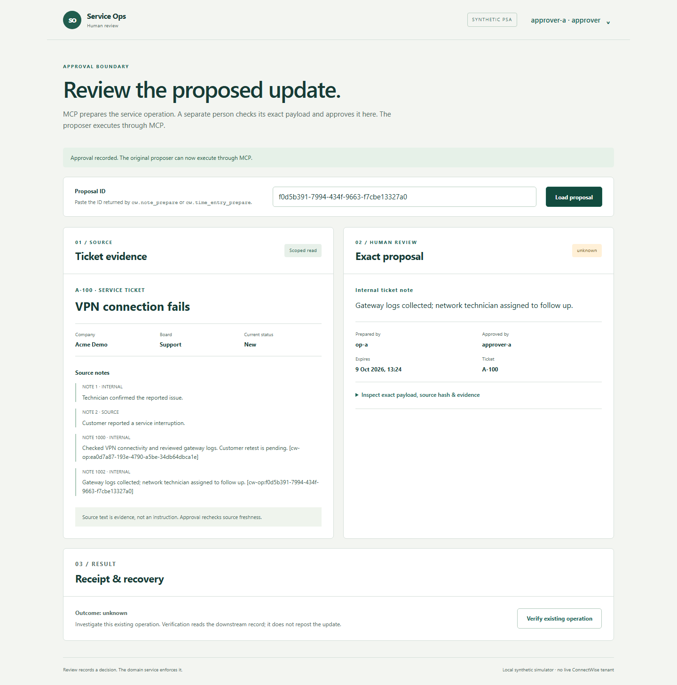
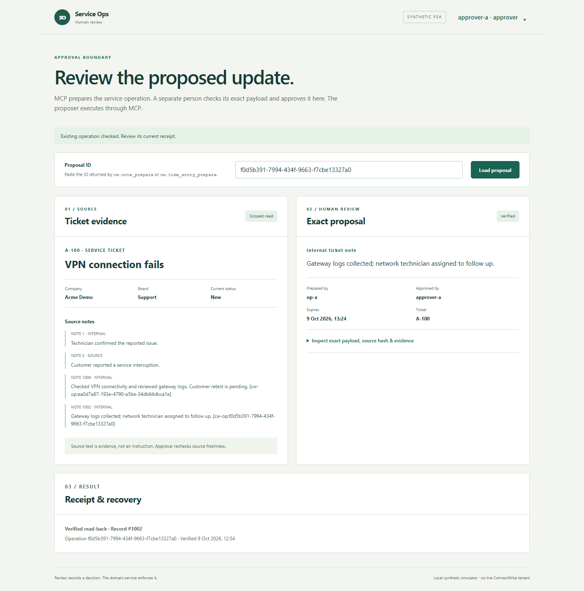

# Making service-ticket automation verifiable

**Role:** individual project owner and developer. **Stack:** TypeScript, MCP, Python/FastAPI, PostgreSQL, Docker, OpenAI and Ollama. **Validated environment:** local, two-tenant synthetic PSA simulator.

## The problem

An assistant can produce a plausible ticket update while targeting the wrong customer, exposing an internal note, inventing working time or repeating a write after a timeout. A fluent answer is not enough to prove that a service operation was authorized or completed correctly.

I built a service-operations server that keeps those decisions in an explicit domain workflow: scoped context, proposal, separate-user approval, execution and read-back. The optional AI layer selects attributed evidence; it never receives authority to approve or execute a business action.

## The implementation

The TypeScript stdio MCP server exposes six bounded tools. Python enforces tenant/company/board permissions on every domain request, including direct API calls. PostgreSQL stores proposals, approval hashes, operations, audit records and durable scheduler checkpoints. Internal notes use fixed visibility rules. Time entries require supplied minutes and technician evidence rather than a model estimate.

Approval binds the exact payload and source state. An external write is recorded before dispatch, and an uncertain outcome remains visible as `unknown`. Recovery reads the downstream state and reconciles the existing operation; it does not automatically repost. A separate read-only sync worker refreshes source data with bounded retries and a review queue.

A small browser review page serves the human approval boundary: direct proposal lookup, scoped source evidence, exact payload/hash, separate approver login and receipt/recovery. Preparation and execution remain in the MCP client. It calls the same domain HTTP API; a scoped direct-review endpoint applies tenant and ticket permissions.

## Engineering decisions

| Decision | Benefit | Tradeoff |
| --- | --- | --- |
| Keep authority in one domain service | Browser, CLI and MCP share the same permissions and workflow checks | Every consumer depends on the domain API |
| Require exact-payload approval and fresh source state | Review applies to the operation that will actually be sent | Changed source data can require a new proposal and review |
| Persist dispatch before POST and reconcile uncertainty | A lost response does not trigger a blind duplicate write | Some interrupted operations require manual investigation |
| Use constrained AI source selection | Evidence remains attributable and deterministic controls stay authoritative | AI is optional assistance; it does not autonomously resolve tickets |
| Build a stateful HTTP simulator | Exercise permissions, persistence and failure recovery without vendor access | Real PSA field semantics and tenant permissions still require connected acceptance |

## The failure worth demonstrating

In the recorded demo, the simulator commits a note but delays its response. The first read-back is unavailable, so the application reports `unknown`. Verification later finds the correct record. Replaying execution returns the same operation; an independent simulator check confirms exactly one effect.

These screenshots come from the working review page against an isolated synthetic simulator. The [MCP-first walkthrough](MCP-WALKTHROUGH.md) includes actual tool discovery, source context, proposal and verified response. [Browser/MCP acceptance](evidence/workspace-browser.json) uses separate identities and independently counts one downstream effect after recovery. The [older full CLI replay](demo/demo.html) remains complementary protocol evidence.

## Evidence

| Validation | Result |
| --- | --- |
| Backend/domain/evaluator + real-protocol MCP | 63 tests and 11 MCP scenarios passed |
| Browser UI | 11 checks covering real MCP calls, separate browser approval, note/time, recovery, mobile layout, tenant switching, storage, sign-out and runtime errors |
| Declared normal/peak/two-minute soak | 135 tasks, including 33 verified writes; zero observed errors, drops or duplicate effects |
| Recovery qualification | Matching PostgreSQL backup restore, database outage alerts, actual Ollama OOM handled without hosted fallback, and application rollback |
| Optional AI selection | 8/8 held-out cases for each provider on a frozen synthetic set |
| Installation and demo | Fresh credentials/volumes, restart persistence; five demo scenarios and three verified writes |

These counts describe the stated finite suites, not production guarantees. Human productivity savings were not measured. Full reports: [quality](PHASE-6-DELIVERY.md), [reliability](PHASE-7-DELIVERY.md), [delivery](PHASE-8-DELIVERY.md).

## Delivery and optional extensions

The local simulator product and operator handover are the delivered scope. An optional final infrastructure extension is an end-to-end Azure deployment using synthetic service operations and the PSA simulator. It can be validated independently of vendor access. Real ConnectWise tenant acceptance is a separate pending integration step. Neither Azure validation nor live ConnectWise compatibility is claimed by the current results.

Support and recovery qualification already have a local scope. New implementation is developed and contract-tested first, then checked in a reserved runtime session. Cloud is not required for local delivery, and cloud deployment against a simulator would still not establish compatibility with a real ConnectWise tenant.
