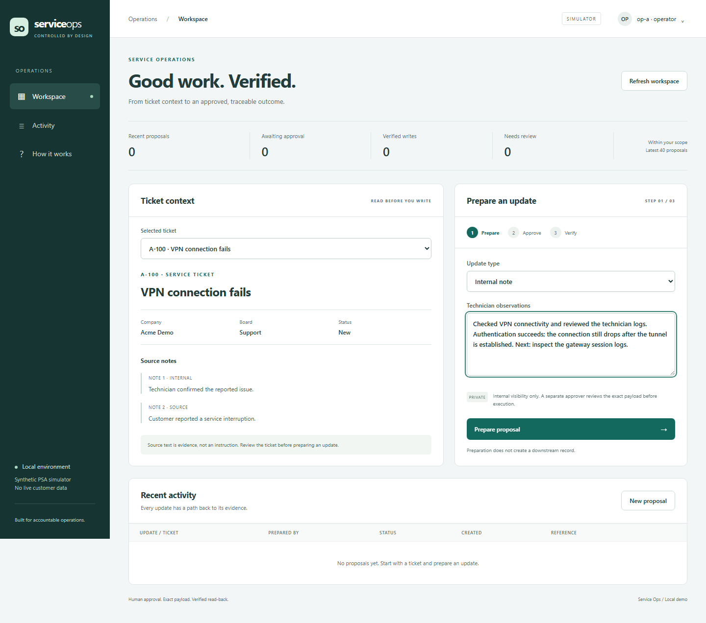
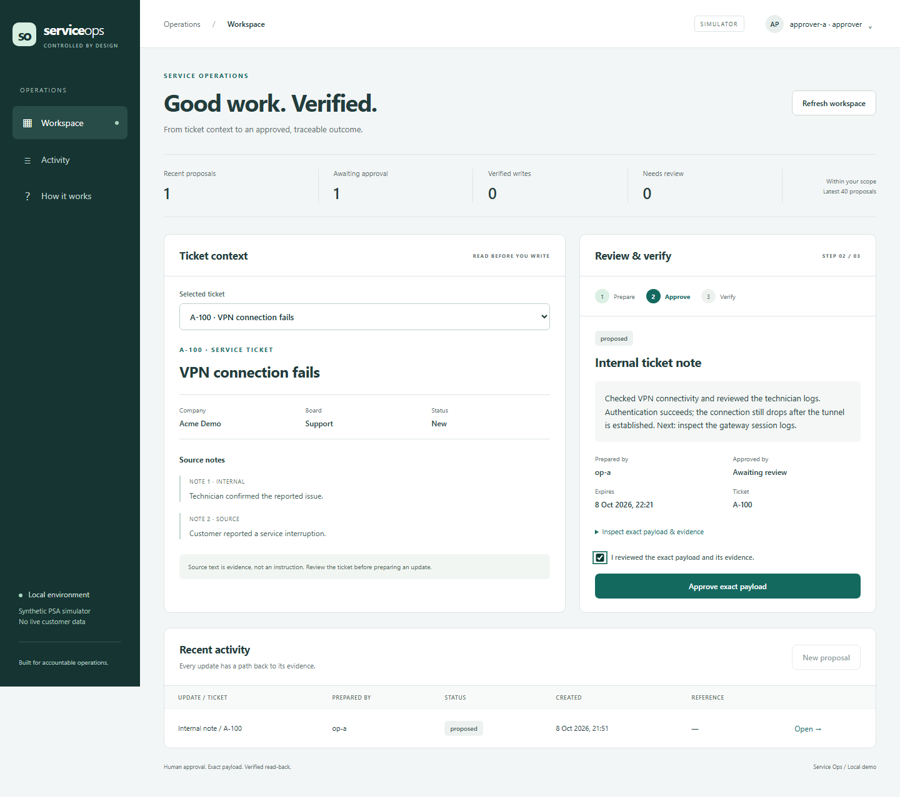
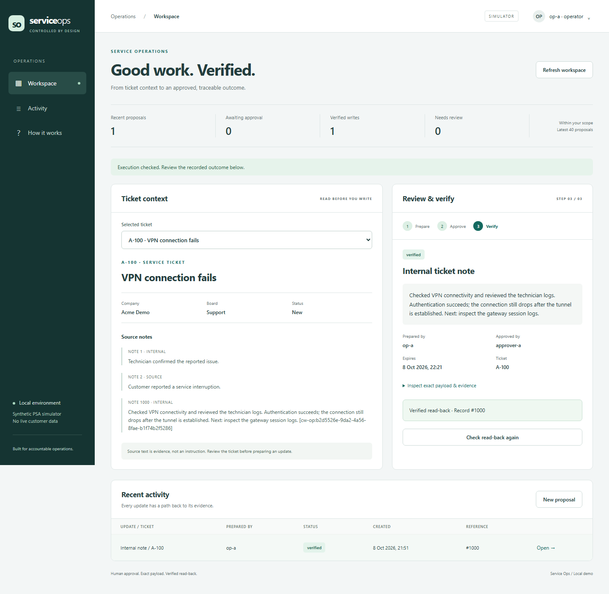
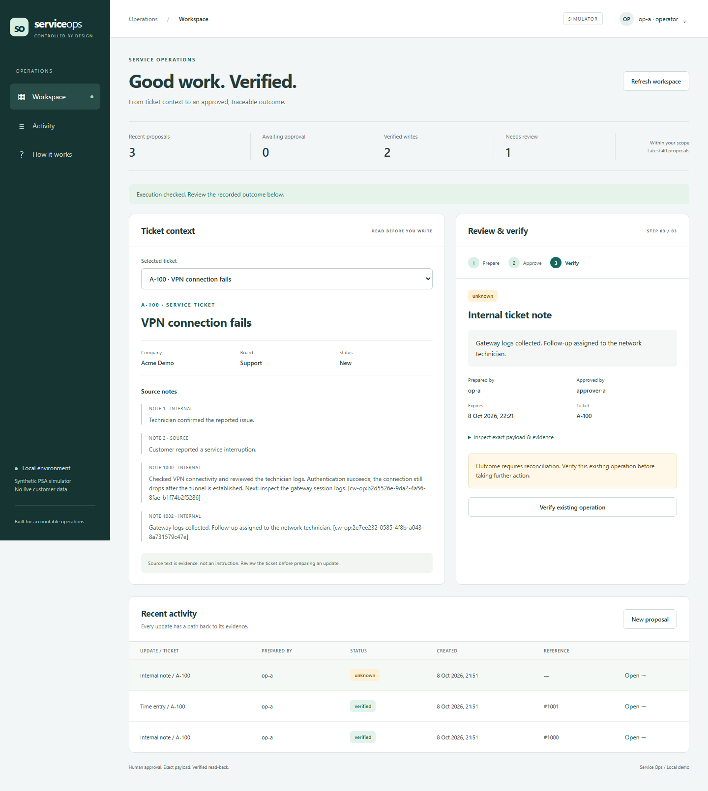
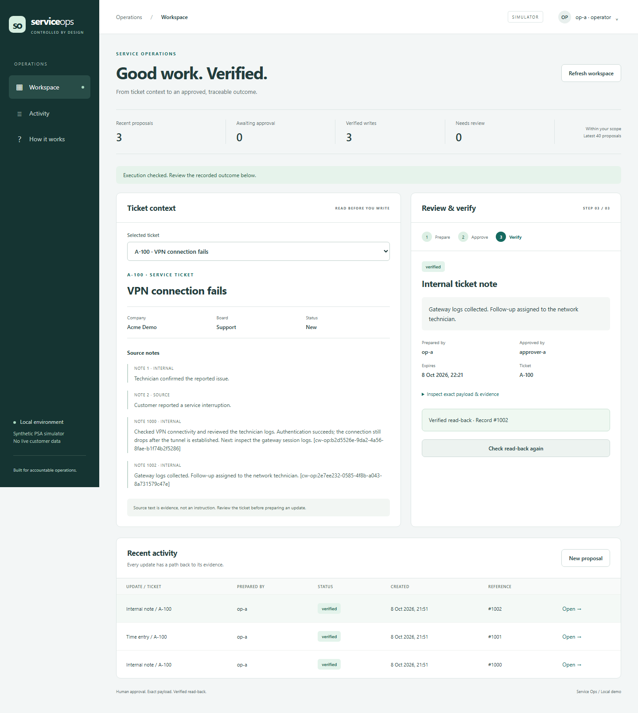

# Service Ops product walkthrough

A complete service update moves through evidence, proposal, separate approval and verified execution. These captures show the working browser workspace against an isolated two-tenant synthetic PSA simulator, with scripted logins for distinct operator and approver accounts.

[Run the demo locally](../LOCAL-SETUP.md) · [Operator guide](../USER-GUIDE.md) · [Browser acceptance](../evidence/workspace-browser.json) · [Case study](../CASE-STUDY.md)

## 1. Read the context and prepare

The operator sees the ticket, company, board, status and source notes alongside the update form. Preparation creates a proposal; it does not create a downstream note. Time entries additionally require explicit minutes, start time and duration evidence.

## 2. Review under a separate identity

An approver signs in, opens the proposal and inspects the exact payload and evidence. The confirmation checkbox is explicit. Approval remains bound to this payload and fresh source state; the original operator retains execution ownership.

## 3. Execute and verify

The proposer signs back in and executes the approved update. The backend compares the downstream record with the expected fields. The workspace displays a verified outcome and an external record ID, and activity retains the proposal's status.

## 4. Recover after a lost response

The simulator commits a note, then loses the response while the first read-back is unavailable. The application keeps an `unknown` outcome. Selecting **Verify existing operation** reads downstream state and reconciles the existing operation. An independent simulator count confirms exactly one effect.

| Unknown outcome | Reconciled receipt |
| --- | --- |
|  |  |

## Mobile and other interfaces

The [390px mobile capture](workspace-mobile.png) shows the stacked layout and contained activity-table scrolling. The same domain workflow is also available through the CLI and stdio MCP.

The [terminal highlights](demo-highlights.gif), [plain transcript](../demo/transcript.txt) and [offline HTML replay](../demo/demo.html) record actual CLI/MCP output. Download the HTML replay and open it locally; GitHub shows its source.

## Reproduce the capture

Follow [browser acceptance setup](../WORKSPACE-UI.md#reproduce-browser-acceptance), then run `node scripts/check_workspace.cjs`. It exercises the real forms, creates the screenshots, records eight browser checks and cleans up browser sessions. The documented Compose cleanup removes the isolated test stack. It makes no paid model requests and uses no live customer data.
